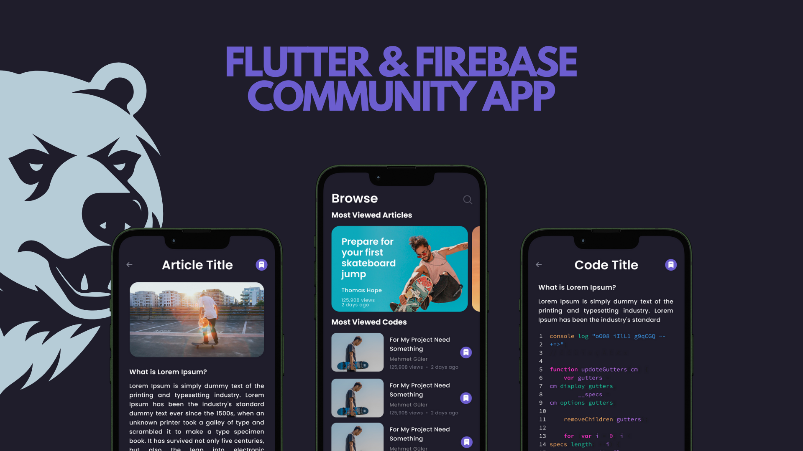

# Flutter Firebase Riverpod Topluluk Projesi

Bu proje, Flutter, Firebase ve Riverpod kullanarak geliştirdiğim bir topluluk projesidir. Bu proje, bir video serisi halinde YouTube üzerinde paylaşılmaktadır.

## Proje Hakkında

Proje, Flutter framework'ü kullanılarak mobil uygulama geliştirmeyi öğrenmek isteyenler için interaktif bir öğrenme deneyimi sunmayı amaçlamaktadır. Firebase, uygulama üzerindeki veritabanı, kimlik doğrulama ve depolama gibi temel özellikleri yönetmek için kullanılırken, Riverpod ise uygulama içindeki durum yönetimi için tercih edilmektedir.
 

## Video Serisi

Bu proje, aşağıdaki konuları içeren bir video serisi olarak yayınlanmaktadır:

1. Flutter ve Firebase Projesi Kurulumu
2. Firebase Authentication ile Kullanıcı Yönetimi
3. Firebase Firestore Kullanımı
4. Firebase Storage ile Dosya Yönetimi
5. Riverpod ile State Yönetimi

Her video, belirli bir konuya odaklanarak adım adım uygulama geliştirmeyi içermektedir. Seriyi takip ederek Flutter ve Firebase ile güçlü uygulamalar geliştirmeyi öğrenebilirsiniz.

## Nasıl Başlamalı?

Projeyle ilgileniyorsanız, aşağıdaki adımları takip edebilirsiniz:

1. Projenin sol üstündeki "Fork" butonuna tıklayarak projeyi kendi GitHub hesabınıza kopyalayın.
2. Projeyi yerel ortamınıza klonlayın: `git clone https://github.com/mhmetglrq/firebase_auth.git`
3. Proje dizinine giderek bağımlılıkları yükleyin: `cd firebase_auth && flutter pub get`
4. Uygulamayı başlatın: `flutter run`

Artık projeyi yerel ortamınızda çalıştırabilir ve geliştirmeye başlayabilirsiniz.

## Katkıda Bulunma

Eğer bu projeye katkıda bulunmak istiyorsanız, lütfen bir "issue" açarak önerilerinizi veya sorunlarınızı paylaşın. Ayrıca "pull request" göndererek projeye katkıda bulunabilirsiniz.

Teşekkür ederim ve iyi kodlamalar!
